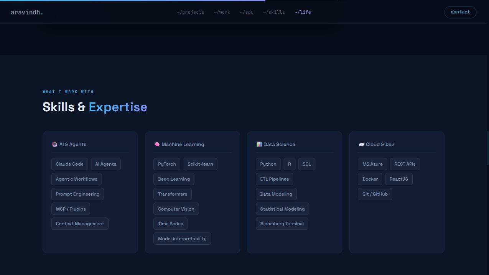
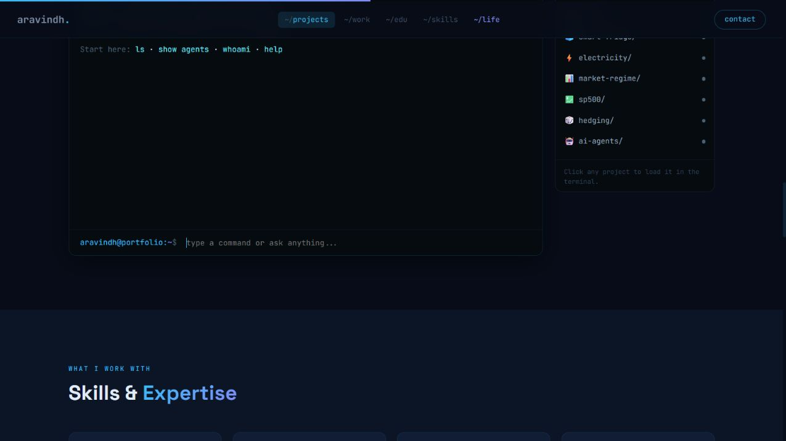
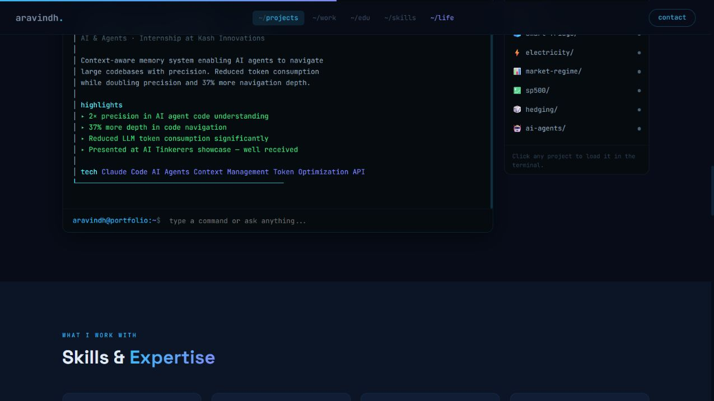
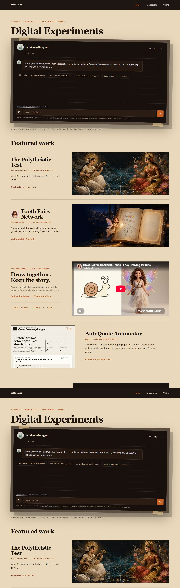
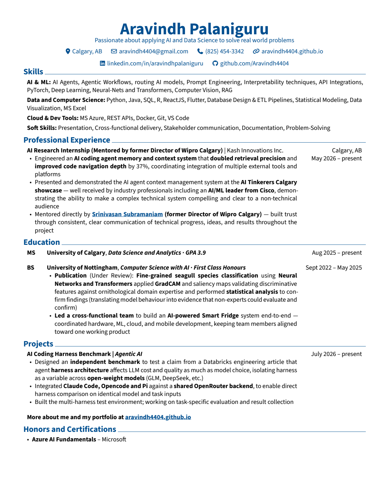
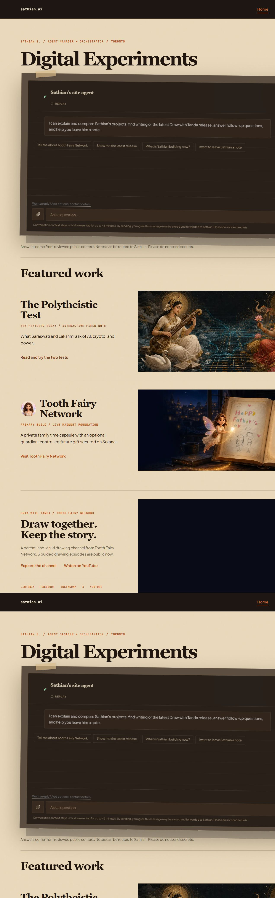
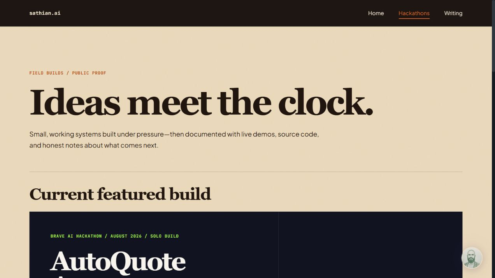
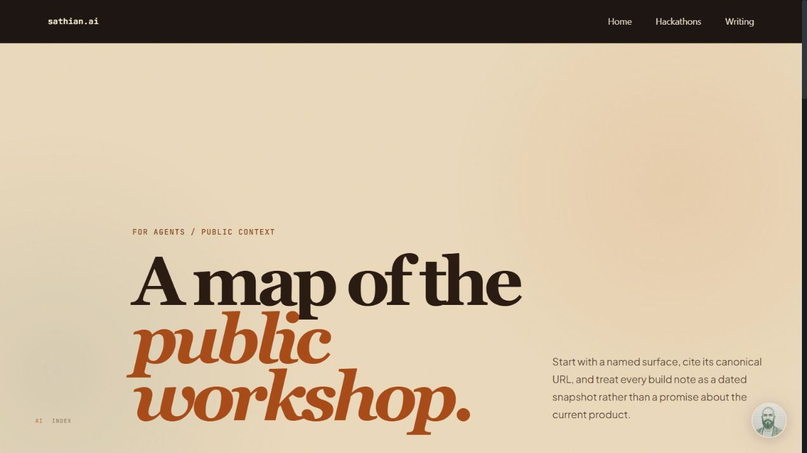
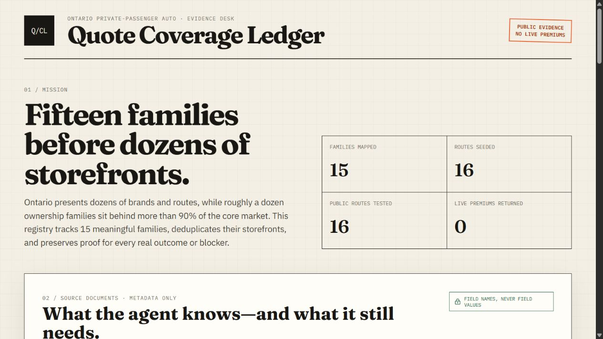

# Aravindh portfolio inspiration audit

Date: 2026-08-17

Reference: https://aravindh4404.github.io/#skills

Comparison: https://sathian.ai

## Decision

This is worth borrowing as a bounded **Agent & Skill Lab** discovery layer. It is not worth copying as a terminal-themed redesign.

The reference works because the site, project terminal, skill categories, quantified proof, and one-page CV all tell the same story: Aravindh builds AI and data systems. Sathian.ai already has the more capable foundation—a governed site agent, reviewed public memory, real products, dated proof, follow-up context, and receipt-based note intake—but visitors have to infer the capability map from individual projects.

The useful move is to make the existing proof easier to browse and to let the existing site agent expose it in a structured way.

## Audit scope

- Reference site entry, project terminal, `show agents` response, skills section, and downloadable CV.
- Current Sathian.ai homepage, project registry, site-agent entry, public agent index, and customer-facing information structure.
- Combined UX and screenshot-visible accessibility review.
- No production code or deployment changes.

## User goal and accessibility target

A prospective customer or collaborator should understand within roughly 20 seconds:

1. what Sathian builds;
2. which problems the agents and skills solve;
3. what is live or proven;
4. what they can try next; and
5. how to start a useful conversation.

The discovery layer should remain understandable without terminal knowledge, work by keyboard and touch, preserve meaningful headings and labels, and not depend on motion, sound, or color alone.

## Captured steps

### 1. Reference skills inventory — healthy, but résumé-first

The four capability groups are instantly scannable. This is the strongest directly borrowable layout pattern. The weakness is that most entries are technology names, so they demonstrate breadth more than customer value.

Borrow the grouping; rewrite each group around a problem, an outcome, and linked proof.

### 2. Reference project terminal — memorable, with discoverability friction

The project inventory, example commands, and adjacent list make the interaction learnable. It turns a static portfolio into an experience.

The terminal metaphor still asks nontechnical visitors to learn a command language, and the screenshot-visible text is small and low contrast. The DOM exposes the input with a label, but much of the project list is generic content rather than clearly named interactive controls.

Borrow the guided exploration and command vocabulary; keep Sathian.ai's familiar buttons, cards, and conversational input.

### 3. `show agents` — the best pattern to adapt

One command returns a concise project brief: purpose, context, quantified highlights, and technology. This is much more useful than a generic chatbot greeting.

Sathian.ai should support equivalent deterministic discovery paths such as `Show me your agents`, `Show me reusable skills`, and `What could you automate for me?`, backed by the same reviewed registry that renders the page.

### 4. Current Sathian.ai — stronger product proof, weaker capability map

The current site is more distinctive, more customer-trustworthy, and better connected to live work. The inline agent is also more capable than the reference terminal: it uses reviewed public context, supports follow-ups, compares work, and can route a deliberate note.

The gap is hierarchy. `Digital Experiments` and the project stories are memorable, but a first-time visitor must infer what Sathian can do for them. The agent occupies a large early surface without first offering a compact visual map of agents, skills, outcomes, and proof.

The full-page browser capture repeats sticky/pinned content while composing the long screenshot; judgments here use the accepted visible opening and project states rather than treating the repetition as a production-page defect.

### 5. Reference CV — healthy one-page proof artifact

The CV is compact, link-rich, and repeats the same quantified claims seen in the interactive site. That consistency creates trust.

For Sathian's customer goal, a conventional employment résumé is secondary. A one-page **Builder Brief** or **Capabilities Brief** would be the better later adaptation: capability clusters, representative products, verified outcomes, working principles, and contact path.

## Strengths worth borrowing

- A clear capability taxonomy that can be understood at a glance.
- A named inventory of agents and projects instead of an open-ended chat prompt.
- Structured, compact agent responses with problem, proof, highlights, and technology.
- Consistency between the public site and a downloadable one-page artifact.
- A small human layer that makes the builder memorable without weakening the technical story.

## UX risks to avoid

- Do not turn the whole site into a terminal or copy the blue-on-black visual language.
- Do not publish a generic technology wall; connect every capability to a customer problem and real proof.
- Do not create a second chatbot, agent runtime, project registry, or public-memory source.
- Do not label prototypes as products or repeat claims that are not in reviewed public context.
- Do not let a new portfolio layer displace the content-publication unifier or the recorded security/dependency work.

## Accessibility risks and evidence limits

- The reference's small monospace text and muted dark-theme copy create visible contrast and readability risk.
- Command-only discovery can exclude visitors unfamiliar with terminal conventions.
- Screenshot and DOM inspection cannot confirm complete keyboard order, focus visibility, screen-reader announcements, zoom reflow, reduced-motion behavior, or measured contrast.
- Sathian.ai's existing release gate has dedicated browser and accessibility coverage; any implementation should extend that gate rather than create a separate QA path.

## Recommended bounded task: Agent & Skill Lab

### Customer-facing shape

- Add one compact homepage teaser: **Agents & Skills — useful systems, shown with proof**.
- Add one customer-readable destination, working title `/lab`, with two views: `Agents` and `Reusable skills`.
- Each card should answer: problem, who it helps, what the system does, proof/status, try it, and related writing.
- Add guided site-agent suggestions: `Show me your agents`, `Show me reusable skills`, and `What could you automate for me?`.
- Keep a compact personal/working-style note on the About surface rather than making the homepage résumé-shaped.

### Shared-source implementation shape

- Extend the existing typed public registry rather than create parallel content.
- Use one reviewed record to render the Lab card and ground the site-agent response.
- Start with three to five evidence-rich entries, not every experiment.
- Treat public skill downloads or generation/sharing as a later phase after the catalog and review boundary are proven.
- Measure meaningful exploration: Lab open, evidence open, demo open, and contact/note intent. Do not promote vanity interactions to key events.

### Definition of done for a future implementation pass

- A first-time visitor can identify at least three capabilities and their proof without using chat.
- The site agent returns the same reviewed facts and canonical links as the visual catalog.
- The change preserves the warm editorial design and the single site-agent architecture.
- Desktop/mobile reflow, keyboard access, focus, contrast, agent singleton, analytics events, and real sound behavior remain covered by `npm run release:verify` and the existing `Site Agent Quality` workflow.
- Production remains a separate explicit approval.

## Priority

Ready as a P2 product/design task. Sequence it after the content-publication unifier and before investing in a downloadable Builder Brief or public skill-sharing mechanics.

## First visual pass

Three customer-facing directions are ready for selection in the existing Sathian.ai Figma release file: a browseable workshop index, proof-led case files, and a conversation-first catalog.

- Decision board: https://www.figma.com/design/4YNMZcegDsyVeJrzTVj3Ik?node-id=6-3
- Status: awaiting selection or refinement; no public-site implementation or deployment has started.
- Content guardrail: generated statuses, outcomes, and descriptive copy are visual placeholders until replaced with reviewed registry truth.

## Go/no-go critique — 2026-08-18

### Decision

**Constrained go.** Direction 3 is worth a small validation build because it compounds the existing site agent, reviewed public memory, receipt-backed note intake, and project registry. Do not build a full agent catalog yet. First correct the public AutoQuote story, then test one conversation-led capability-discovery path inside the existing site agent.

The customer value is not “browse my agents.” It is: **show me what kind of repetitive, evidence-sensitive work could be safely taken off my plate, what proof exists, where a human remains responsible, and how to discuss adapting the pattern.**

### Captured flow

#### 1. Homepage site-agent entry — healthy foundation, weak buyer framing

The site agent is already the first interactive surface and has reviewed-context, privacy, receipt, conversation, and release-quality infrastructure. Its starter prompts are project-oriented, not customer-problem-oriented. The smallest useful experiment is to replace one prompt with `What could an agent take off my plate?`, not add another large homepage section.

#### 2. Hackathons page — current trust problem

AutoQuote is presented as `BRAVE AI HACKATHON / AUGUST 2026 / SOLO BUILD`, `Current featured build`, and a system that returns a comparable quote or blocker. Sathian confirmed it was not submitted and the automation is not complete. This is a material truth mismatch and should be corrected before any agent catalog amplifies it.

#### 3. Existing `/agents` page — healthy, but for machines and source discipline

The route is a canonical public-source map with reading rules and build receipts. Keep it. Recasting it as a customer catalog would blur a useful machine-facing boundary. A customer-facing capability view should start in the existing site-agent conversation and earn a separate route only if people use it.

#### 4. AutoQuote public shell — legitimate evidence artifact, not an automator

The public build is not empty: it contains a market map, privacy boundary, workflow design, 16 public-route observations, and an honest `0 live premiums` result. That is useful proof. It is not evidence of completed quote automation. Position it as a **private research prototype with a public evidence ledger**, not a live service or submitted hackathon build.

Recommended public wording:

- Label: `PRIVATE RESEARCH PROTOTYPE / PUBLIC EVIDENCE`
- Description: `A personal Ontario auto-insurance research prototype. The public page shows the market map, workflow design, and redacted route observations; personal profile data and live form execution remain local.`
- Boundary: `Not a quoting service. No live premiums, public personal data, insurer-form submission, purchase, or binding action.`
- CTA: `View the public research ledger`

Do not offer raw code as the default CTA. Offer a private architecture walkthrough or a conversation about adapting the pattern. A sanitized starter framework should be created only after repeated demand proves it is useful.

### Smallest engineering slice

1. Correct AutoQuote claims wherever the shared registry feeds the homepage, hackathons page, current-work answer, and site-agent memory.
2. Extend the existing reviewed registry with explicit maturity, visibility, customer problem, boundary, evidence, and availability fields. Derive the capability view from that source rather than creating a second project truth store.
3. Add one deterministic site-agent path: `What could an agent take off my plate?` → three truthful capability patterns → selected pattern with proof and boundary → existing receipt-backed note flow.
4. Start with only three patterns: public knowledge guide, evidence-backed research/intake, and bounded workflow automation. AutoQuote is evidence for the third pattern, not a public service.
5. Add a small non-chat fallback summary, semantic buttons/lists, keyboard and focus coverage, mobile reflow, and analytics for capability open, selection, proof open, and qualified note intent.
6. Keep `/agents` machine-facing. Add a separate customer route only after the conversation path earns use.

### Validation gate

Run the experiment until at least 50 relevant visitors have seen the capability prompt. Continue only if visitors select a capability, open proof, or start a qualified note at a meaningful rate and the conversations reveal repeated workflow problems. If the interaction produces curiosity clicks but no concrete problems or notes, keep the truthful AutoQuote correction and stop the catalog build.

### Evidence limits

This critique inspected current production pages, current source-controlled registry and agent-memory paths, and current public market evidence. It did not submit a site-agent question, send a note, expose private AutoQuote data, run the local AutoQuote runner, or validate insurer workflows. The screenshots support UX and copy findings, not a claim of full accessibility or automation completeness.

## Local implementation status — 2026-08-18

The approved AutoQuote truth correction is implemented in the canonical worktree but not deployed. AutoQuote remains a featured homepage project as a `PRIVATE RESEARCH PROTOTYPE / PUBLIC EVIDENCE`, is excluded from active-current-work answers, and is removed from the hackathon submission record. The site-agent evaluation contract now rejects the former active-build framing and passes all 60 offline cases.

The plain-English capability-discovery blueprint and implementation sequence are recorded in `docs/plans/2026-08-18-conversation-led-capability-discovery.md`. The capability layer itself remains a separate small release; AgentTab product work remains in its separate thread and can later strengthen the bounded-automation proof relationship.
