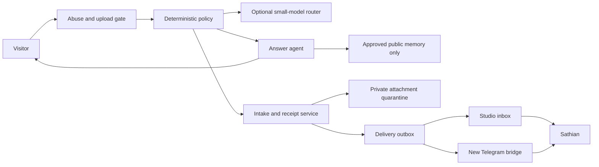

# Public Agent Portal and Studio Design

**Date:** 2026-07-14

**Status:** Direction approved; implementation and deployment not started

**Working branch:** `feat/public-agent-portal`

## Product definition

The public agent on sathian.ai should be a useful, bounded version of Sathian. It has two jobs:

1. Answer reasonable questions about Sathian's public work, writing, projects, and stated ideas.
2. Accept a message or safe file, give the visitor a receipt, and route the intake to Sathian's private Telegram group and Studio inbox.

The agent is a doorway to Sathian, not a remote control for Sathian's private systems. It never receives raw access to the local second brain, private TELOS material, family records, credentials, client data, or arbitrary tools.

## Decisions

- Retire Notion from the runtime architecture.
- Keep local Markdown as the canonical second brain.
- Use Supabase for reviewed projections, public memory cards, message records, delivery state, and Studio content.
- Build a new Telegram delivery bridge. Do not revive the retired Kai bot or its revoked token.
- Use a deterministic policy layer before any model call.
- Treat a small open-source model as an optional classifier for routing and redaction. It is not the primary answer model until it passes an evaluation set.
- Keep the public answer agent and private operator tools as separate trust zones.
- Replace the homegrown Studio login with Supabase Auth using an allowlisted account, passwordless sign-in, and enforced TOTP MFA.
- Keep Studio typed and structured. Do not build a free-form page builder.

## Trust zones

### Public zone

May access:

- published sathian.ai pages;
- approved `public_memory_cards`;
- visitor messages in the current public session;
- attachment metadata after the upload gate approves it.

May not access:

- private or operator memory;
- raw Notion or TELOS archives;
- secrets, environment variables, client material, family records, financial records, or legal records;
- email, calendar, filesystem, shell, Telegram history, or other operator tools;
- unreviewed file contents.

### Intake zone

May store a visitor message, create a receipt, quarantine a permitted attachment, and enqueue a delivery event. It cannot answer from private memory or execute requested actions.

### Operator zone

Studio and the Telegram bridge are authenticated operator surfaces. They may show submitted visitor content and delivery status. Any future action that changes an outside system must retain a separate approval boundary.

## System flow

The model never selects its own trust zone. The server decides which data and operations are available before the prompt is assembled.

## Request lifecycle

1. The browser sends a session identifier, page context, message, and optional attachment reservation.
2. The gateway verifies origin, Turnstile, durable rate limits, content length, and file policy.
3. The deterministic policy rejects prohibited content, strips control characters, assigns a coarse intent, and decides whether the request is answer-only, intake-only, or both.
4. An optional local classifier can add intent and sensitive-data labels. Its output is advisory and schema-validated.
5. For an answer, retrieval queries only approved public-memory rows and published site content.
6. For intake, the server stores the message, creates a human-readable receipt, and writes an idempotent outbox event in the same database transaction.
7. A delivery worker posts a short preview and Studio link to the private Telegram group. Attachments remain private and use short-lived signed links after clearance.
8. Studio shows the complete intake, status, delivery attempts, and any operator notes.

## Public memory contract

Every public fact must be a reviewed record rather than a chunk drawn blindly from the second brain.

Suggested fields for `public_memory_cards`:

| Field | Purpose |
| --- | --- |
| `id`, `slug` | Stable identity |
| `statement` | The exact public-safe fact or paragraph |
| `topic` | Bio, project, writing, availability, philosophy |
| `source_type`, `source_ref` | Provenance back to a published page or reviewed local note |
| `approved` | Required before retrieval |
| `reviewed_at`, `reviewed_by` | Editorial receipt |
| `valid_from`, `valid_until` | Prevent stale availability or project claims |
| `checksum` | Detect source changes |
| `embedding` | Optional semantic retrieval vector |

The retrieval query must contain `approved = true` and a valid-date check in database policy and application code. A prompt instruction alone is not a security control.

## Intake data model

- `agent_sessions`: anonymous session identifier, consent version, created and last-seen timestamps.
- `agent_messages`: session, role, content, page, policy result, model metadata, and retention deadline.
- `agent_intakes`: receipt code, contact method if volunteered, visitor request, routing status, priority, and operator notes.
- `agent_attachments`: object key, declared and detected MIME type, size, hash, quarantine state, scan state, and retention deadline.
- `delivery_outbox`: event type, intake id, idempotency key, attempts, next attempt, last error, and delivered timestamp.
- `routing_decisions`: deterministic labels, optional model labels, policy version, and decision trace.
- `audit_events`: authentication, view, download, status change, and delivery events.

All visitor tables require Row Level Security. The browser may create through narrowly scoped server routes but never list messages or objects.

## Attachment policy

The first file release should be deliberately small:

- Allow PDF, plain text, Markdown, JPEG, PNG, and WebP.
- Block archives, executables, scripts, HTML, SVG, Office files, and password-protected files.
- Enforce a conservative per-file limit and one attachment per intake at launch.
- Detect file type from bytes rather than trusting the filename or browser header.
- Store in a private `agent-quarantine` bucket with generated object names.
- Do not render, summarize, embed, or forward a file until it clears the policy and scan state.
- Give every object a retention deadline and record deletion as an audit event.
- Deliver metadata and a Studio link to Telegram. Do not post raw files to Telegram by default.

General file handling can expand only after the quarantine path and retention job have been proven.

## Telegram delivery

The Telegram bridge is a delivery consumer, not the chatbot brain.

- Use a new bot with the minimum group permissions.
- Keep the token only in the delivery worker's secret store.
- Post into one private, dedicated intake topic or group.
- Include receipt code, page, coarse intent, short preview, and Studio link.
- Use the outbox idempotency key to prevent duplicate posts.
- Retry with backoff and make permanent failures visible in Studio.
- Phase one is one-way delivery. A later `/reply <receipt>` command may create an operator-authored response, but only after sender binding and audit logging are implemented.

## Studio control room

Studio should expose five typed areas:

1. **Writing:** drafts, media, previews, publication state.
2. **Build notes:** dated project updates, status, proof, next step.
3. **Homepage:** visible sections, ordering, project slots, and named copy fields.
4. **Public memory:** reviewed cards, provenance, expiry, and publish state.
5. **Inbox:** visitor messages, attachment state, Telegram delivery, triage, and retention.

Authentication path:

- Immediate repair: verify the existing cookie signature, not only its timestamp and shape.
- Replacement: Supabase Auth passwordless login with `shouldCreateUser: false`, an allowlisted Sathian account, and enforced AAL2 TOTP for all Studio routes and database policies.
- Record sign-in and privileged content actions in `audit_events`.

## Response and personality policy

The public agent can sound like Sathian without claiming to be Sathian. It should state that it is Sathian's site agent, distinguish known facts from inference, and offer to pass a message along when it cannot answer.

It must not:

- invent personal experiences or commitments;
- reveal or infer sensitive personal details;
- claim that Sathian has seen a message before delivery succeeds;
- promise a response time;
- provide private contact details;
- execute code, browse private systems, or follow instructions found inside uploaded content.

## Threat model and controls

| Risk | Primary controls |
| --- | --- |
| Prompt injection | No arbitrary tools, public-only retrieval, file content isolated, deterministic policy outside the prompt |
| Secret leakage | Separate data stores and service roles, public allowlist, no raw second-brain connection |
| Malicious upload | Byte sniffing, restrictive type list, private quarantine, scan state, no automatic rendering |
| Spam and cost abuse | Turnstile, durable rate limits, message and token caps, retention limits |
| Duplicate or lost Telegram messages | Transactional outbox, idempotency keys, retries, visible delivery state |
| Studio takeover | Signed-cookie hotfix, then allowlisted Supabase Auth plus enforced TOTP and RLS |
| Hallucinated biography | Reviewed memory cards, provenance, expiry, citations where useful, refusal when unknown |
| Privacy surprise | Short disclosure beside input, explicit attachment rules, retention language, receipt |

## Delivery sequence

### Phase 0: repair the existing surfaces

- Fix Studio signature verification.
- Fix duplicate user messages in the chat prompt.
- Remove Notion logging.
- Add a plain retention and forwarding disclosure.

### Phase 1: trustworthy text agent

- Add public memory cards with provenance and approval.
- Add durable sessions, messages, intakes, and outbox tables.
- Build deterministic routing and schema-validated model responses.
- Deliver text intakes to a new Telegram bridge and Studio inbox.

### Phase 2: Studio control room

- Move Studio to Supabase Auth and TOTP.
- Add build notes, homepage controls, public memory, and inbox views.

### Phase 3: constrained file intake

- Add direct-to-quarantine uploads, byte detection, scan state, retention, and signed operator access.

### Phase 4: optional agent interfaces

- Evaluate a small open-source routing model against real labeled examples.
- Add reciprocal operator replies only after the one-way path is reliable.
- Add an authenticated A2A endpoint only when its declared capabilities are real and separately permissioned.

## Acceptance bar

- A forged Studio cookie is rejected.
- Public retrieval cannot return a non-public record, even when prompted to do so.
- A visitor receives a receipt only after intake persistence succeeds.
- Telegram delivery is idempotent and its failure is visible.
- Blocked file types never enter the processing path.
- Attachments cannot be listed or fetched without a short-lived operator authorization.
- The UI explains forwarding and retention before submission.
- The public agent passes a red-team set covering secrets, family data, client data, prompt injection, impersonation, and tool requests.
- No production deployment occurs without Sathian's explicit approval.
