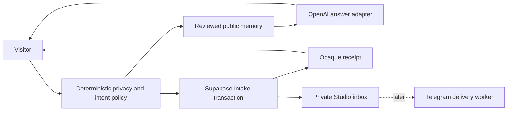

# LinkedIn-First TxODDS Launch Sprint

Date: 2026-07-15
Status: Direction approved across the July 14-15 review sequence; implementation in progress
Branch: `feat/public-agent-portal`

## Outcome

Ship sathian.ai as a simple public notebook with a useful, bounded site agent, then use it as the proof surface for a LinkedIn-first TxODDS referral campaign. The launch must preserve the existing public/private trust boundary and keep VPS, OpenRouter, raw second-brain retrieval, general file processing, and automated social posting outside the critical path.

## Architecture decision

The launch stays on Vercel and Supabase. OpenAI supplies the public answer model through the existing `AnswerModelAdapter`; the deterministic policy, reviewed public-memory query, rate limiter, intake transaction, receipt, and audit contract remain provider-independent. GPT-5.4 mini is the launch model because it supports Chat Completions and is designed for faster high-volume workloads. The current installed SDK already supports the required request shape.

The VPS remains a later worker plane. It is not needed to answer a visitor, store a note, or complete the campaign. OpenRouter and smaller or open-source models can be evaluated later against the same adapter and a labeled answer/privacy set.

## Request flow

The model never receives raw private memory and never decides whether it may use tools. Hard-deny requests stop before retrieval, storage, or a model call.

## Campaign slice

After Sathian supplies his unique referral URL, add one reviewed, expiring campaign card with the exact TxODDS facts, eligibility, deadline, tracks, referral URL, and source. Add five question starters focused on track fit and realistic project ideas. The card must expire after the campaign rather than become stale biography.

The homepage needs only a small live-experiment banner or build note. LinkedIn carries the full invitation, X receives a shorter adaptation, and the TFN update follows as a separate post.

## Error handling

- Missing OpenAI key: safe model-unavailable fallback; stored intake remains valid.
- Provider timeout or error: content-minimized audit event; no provider detail or visitor message in logs.
- Unsupported or unknown question: honest reviewed-information fallback.
- Private or secret request: deterministic 403 before model or persistence.
- Duplicate note: existing idempotency contract prevents a second receipt/outbox event.
- Missing referral link: campaign card and public CTA remain unpublished.

## Verification

1. Provider-selection test proves the public route uses `OPENAI_API_KEY`, GPT-5.4 mini, and the existing answer token cap.
2. Existing route and privacy tests prove hard denies, receipts, rate limiting, model-failure handling, and content-minimized observability.
3. Full unit suite and TypeScript check pass.
4. Production build passes against the approved environment source without printing secrets.
5. Protected preview proves reviewed answers, unknown answers, hard denies, and one stored synthetic note.
6. No production deploy or public post occurs until Sathian explicitly approves it.

