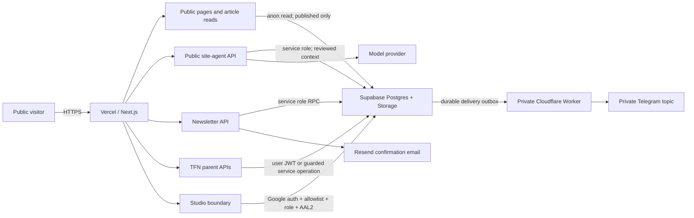

# Sathian.ai Security Architecture

Date: 2026-07-23  
Scope: `sathian.ai`, the embedded Tooth Fairy Network routes, Studio, the public site agent, newsletter intake, Supabase, Vercel, Resend, and the private Telegram delivery worker.

## Executive view

The site has several strong boundaries already: HTTPS, server-only service credentials, RLS on every public-schema table, MFA-gated Studio administration, a private quarantine bucket, reviewed public memory for the site agent, hashed visitor identifiers, and a durable Telegram outbox.

Two concrete release blockers were found in the current production database:

1. Legacy RLS policies and grants permit anonymous mutation of `articles`, `family_members`, `tooth_states`, and some TFN tables.
2. The current email form writes to a schema that does not match its payload and reports success after failure. No subscriber was recorded, no confirmation email was sent, and no Telegram notification was created.

This release candidate contains migrations that remove the accidental public write paths and creates a dedicated private subscriber system. Both migrations were syntax- and contract-validated inside a production transaction that was rolled back. They are not applied to production yet.

## Trust zones and data flow

## Assets and boundaries

### Public web surface

- Hosted by Vercel over HTTPS with HSTS.
- `X-Content-Type-Options`, `X-Frame-Options`, `Referrer-Policy`, and a restricted `Permissions-Policy` are set.
- No production browser source maps.
- CORS is allowlist-based for API routes.
- A Content Security Policy is not currently set.

### Public site agent

- Reads only approved `public_memory_cards`.
- Messages, contact fields, routing decisions, and delivery receipts are server-side only.
- Visitor IP addresses are HMAC-hashed before storage.
- Message and upload quotas are durable in Supabase; the generic middleware limiter is only a best-effort extra layer.
- Attachments use the private `agent-quarantine` bucket with a 5 MB limit and an explicit MIME allowlist.
- The private Cloudflare Worker claims a durable outbox and sends Telegram messages. Telegram secrets remain in the worker.
- Legacy Telegram variables also remain in Vercel for older routes and should be retired when those routes are removed.

### Studio

- Google authentication.
- Explicit email allowlist.
- `studio_admin` role in JWT app metadata.
- AAL2/MFA required for sensitive data and mutations.
- Server APIs use the service role after middleware authorization.

### Newsletter in this release candidate

- Dedicated `newsletter_subscribers` and `newsletter_signup_events` tables.
- RLS enabled; no anonymous or normal authenticated access.
- Service-role-only `newsletter_subscribe` RPC.
- Lowercased unique email prevents duplicates.
- HMAC visitor hash and a five-attempts-per-hour durable limit.
- A hidden honeypot reduces simple automated submissions.
- A successful new signup creates a Studio contact receipt and durable Telegram outbox event.
- Resend sends a source-specific confirmation from `hi@sathian.ai` or `noreply@toothfairy.network`.
- Persistence failure is shown as failure; the API no longer returns false success.

### Tooth Fairy Network

- Parent sessions use Supabase Auth.
- Private family, gift, contribution, signup, rate-limit, and capsule buckets exist.
- Public cNFT metadata and intentionally shareable keepsake assets use public buckets.
- `tfn_tooth_stories` are intentionally readable by possession of a public milestone PDA.
- `tfn-photos` is public and contains 34 JPEG objects. Paths are not advertised as a directory, but any known public URL remains readable. This needs an explicit product/privacy decision because those images may include children.
- `tfn-capsules` is public and contains 273 objects, including encrypted notes and story media. Encryption reduces note exposure, but public object access increases metadata and availability risk.

## Findings by priority

### P0 — fix before this release goes live

1. **Anonymous database writes.** Live grants plus permissive RLS currently allow anonymous article writes/deletes and unrestricted access on old family/tooth tables. Migration `20260723170000_public_grant_hardening.sql` removes those paths while preserving published article reads, owner-scoped TFN child access, and intentional keepsake reads.
2. **False-success newsletter.** Current production has zero recorded newsletter subscribers. The new migration and API replace the broken `thoughts` insert.

### P1 — schedule immediately after the release

1. **Public child-photo bucket.** Decide whether public keepsakes should ever expose a smile photo. Preferred design: private originals plus short-lived signed derivatives for authenticated parent views; public keepsakes should use an explicitly approved derived image.
2. **Framework and dependency backlog.** `npm audit --omit=dev` reports 138 advisories: 1 critical, 41 high, 78 moderate, and 18 low across 1,708 production dependencies. Much of the count comes through the large Crossmint/Dynamic/Remotion/Solana dependency graph, but Next.js 14.2.35 also has current advisories. Upgrade Next in an isolated compatibility branch and remove browser/runtime packages not used by the active product.
3. **No Content Security Policy.** Add a report-only CSP first, observe required origins for Supabase, Resend-independent API calls, media, wallet providers, analytics, and model-related endpoints, then enforce it.
4. **Monolithic blast radius.** Personal site, TFN, Studio, agent, Lex data, and legacy memory tables share one Supabase project. Long-term, separate personal publishing/agent data from child/family product data.

### P2 — planned hardening

1. Enable Supabase leaked-password protection.
2. Correct mutable `search_path` on legacy search/update functions.
3. Move the `vector` extension out of `public` during a controlled migration.
4. Add self-serve unsubscribe and double opt-in before broad newsletter distribution, plus a retention/purge job for signup event rows.
5. Remove unused Vercel secrets and legacy Notion/Telegram/waitlist routes after confirming no callers remain.
6. Replace the generic in-memory middleware rate limiter with only route-specific durable quotas. Serverless instances do not share its state.
7. Add COOP/CORP where wallet and embedded-media compatibility permits.

## Storage review

| Bucket | Access | Current note |
|---|---|---|
| `agent-quarantine` | Private | 5 MB, explicit MIME allowlist |
| `tfn-private-*` | Private | Family, gift, contribution, capsule data |
| `tfn-signups` / `tfn-rate-limits` | Private | Operational controls |
| `tfn-cnft-public` | Public | Intended public cNFT metadata/images |
| `toothlight-images` | Public | Intended shareable images; verify consent model |
| `tfn-photos` | Public | 34 JPEGs; privacy decision required |
| `tfn-capsules` | Public | 273 objects; encrypted notes plus media |

## Release verification required

- Apply both migrations in order.
- Re-run Supabase security advisors and verify the permissive mutation warnings are gone.
- Submit one controlled `sathian-home` test address:
  - one `newsletter_subscribers` row,
  - one `newsletter_signup_events` row,
  - one Studio contact receipt,
  - one Telegram delivery,
  - one Resend confirmation.
- Repeat from the TFN footer and confirm source attribution.
- Verify duplicate submission creates no duplicate subscriber or Telegram alert.
- Verify invalid email, honeypot, and rate-limit paths.
- Verify Studio still requires allowlist, role, and AAL2.
- Verify article create/edit/publish through Studio after the articles-policy hardening.

## Evidence

- Supabase project: `tvujxgdwgvrunjvhseey`
- Production subscriber aggregate before fix: 0 rows / 0 unique subscribers.
- Security advisor review: 2026-07-23.
- Storage inventory review: 2026-07-23.
- Dependency audit: 2026-07-23.
- Live headers review: 2026-07-23.
- Migration validation: production transaction completed and rolled back on 2026-07-23.

References:

- [Supabase Row Level Security](https://supabase.com/docs/guides/database/postgres/row-level-security)
- [Supabase API security](https://supabase.com/docs/guides/api/securing-your-api)
- [Supabase database linter](https://supabase.com/docs/guides/database/database-linter)
